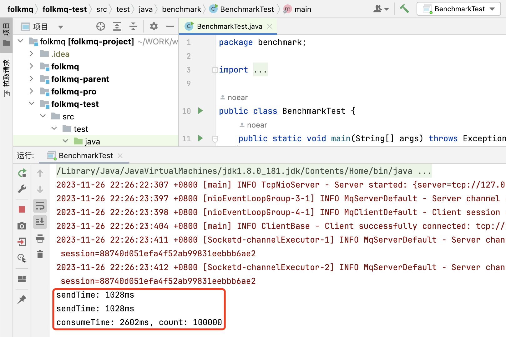
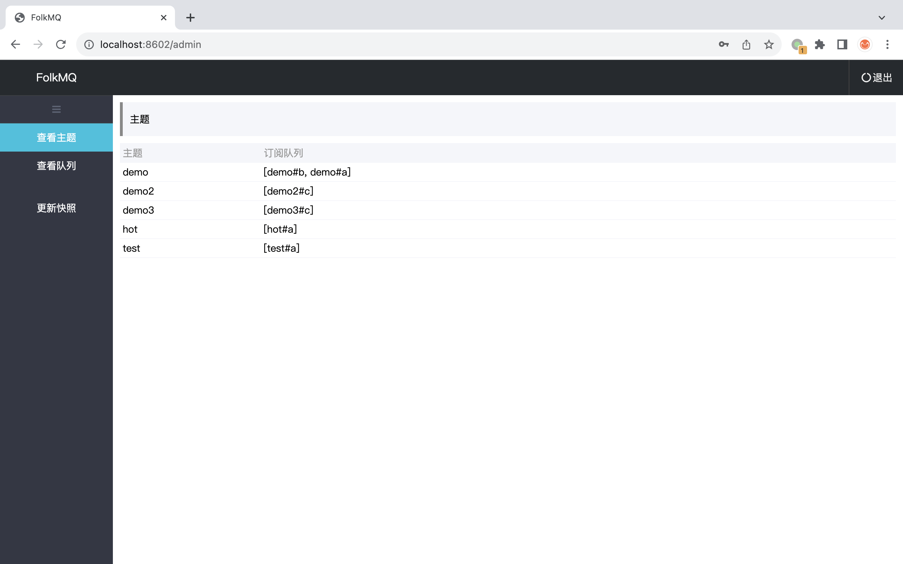

<h1 align="center" style="text-align:center;">
  FolkMQ
</h1>
<p align="center">
	<strong>一个内存型消息中间件（支持快照持久化、Broker 集群）</strong>
</p>

<p align="center">
    <a target="_blank" href="https://search.maven.org/artifact/org.noear/folkmq">
        
    </a>
    <a target="_blank" href="https://www.apache.org/licenses/LICENSE-2.0.txt">
		
	</a>
   <a target="_blank" href="https://www.oracle.com/java/technologies/javase/javase-jdk8-downloads.html">
		
	</a>
    <a target="_blank" href="https://www.oracle.com/java/technologies/javase/jdk11-archive-downloads.html">
		
	</a>
    <a target="_blank" href="https://www.oracle.com/java/technologies/javase/jdk17-archive-downloads.html">
		
	</a>
    <a target="_blank" href="https://www.oracle.com/java/technologies/javase/jdk21-archive-downloads.html">
		
	</a>
    <br />
    <a target="_blank" href='https://gitee.com/noear/folkmq/stargazers'>
        
    </a>
    <a target="_blank" href='https://github.com/noear/folkmq/stargazers'>
        
    </a>
</p>

<br/>
<p align="center">
	<a href="https://jq.qq.com/?_wv=1027&k=kjB5JNiC">
	</a>
</p>


<hr />

## 简介

* 采用 类似 Redis 的策略（内存运行 + 快照持久化）
* 功能 订阅、取消订阅、发布消息、发布定时消息、ACK，自动重试、延时策略、Qos0、Qos1
* 集群 采用 Socket.D Broker 集群模式
* 支持 使用 ws,udp 通讯（或许，也可用于物联网）

## 特点

* 快、是真的快（大约 100_000 TPS）。有点像 Redis 之于 MySql。



//使用 MacBook pro 2020 + JDK8 本机测试，单客户端发与收（跑分难免有波动，我是选了好看点的）

* 简单的管理后台



### 加入到社区交流群

| QQ交流群：316697724                       | 微信交流群（申请时输入：FolkMQ）          |
|---------------------------|----------------------------------------|
|        |  


## 开发过程视频记录

* 开发过程视频：[《DEV-RECORD.md》](DEV-RECORD.md)
* 成果展示：[《[FolkMQ] 一个新的内存型消息队列（快，特别的快）》](https://www.bilibili.com/video/BV1mc411D7pY/)
* 快速入门：[《FolkMQ - Helloworld 入门》](https://www.bilibili.com/video/BV1Yj411L7fB/)

## 服务端容器镜像

| 镜像                            | 说明                       |
|-------------------------------|--------------------------|
| noearorg/folkmq-server:1.0.10 | 服务端（主端口：8602，消息端口：18602） |
| noearorg/folkmq-broker:1.0.10 | 服务端（主端口：8602，消息端口：18602） |

当使用 broker 集群时，把 folkmq-server 端口改成：8601

* 可选配置

| 属性或环境变量                       | 默认值 |                       |
|-------------------------------|-----|-----------------------|
| `server.port`                 |  8602   | 主端口(http，管理用)         |
|                               |  18602   | 消息端口(tcp)，等于主端口+10000 |
| `folkmq.admin`                |  admin   | 管理密码                  |

* 添加消息访问账号：

添属性或环境变量，例： `folkmq.access.ak1=sk1`，`folkmq.access.ak2=sk2`

## Helloworld

### 1、启动服务 (更多部署参考：[部署说明](deploy))

```
docker run -p 18602:18602 -p 8602:8602 noearorg/folkmq-server:1.0.10 
```

### 2、编写客户端代码

* maven import

```xml
<dependencies>
    <!-- 可选包：java-tcp（90kb左右）, smartsocket（260Kb左右）, netty（2.5Mb左右） -->
    <dependency>
        <groupId>org.noear</groupId>
        <artifactId>folkmq-transport-java-tcp</artifactId>
        <version>1.0.10</version>
    </dependency>
</dependencies>
```


* client(consumer + producer) use

```java
public class ClientDemo1 {
    public static void main(String[] args) throws Exception {
        //客户端（鉴权为可选。服务端，不添加则不鉴权）
        MqClient client = FolkMQ.createClient("folkmq://127.0.0.1:18602?ak=folkmq&sk=YapLHTx19RlsEE16")
                .connect();

        //订阅（consumer = ip or cluster name）
        client.subscribe("demo", "demoapp", message -> {
            System.out.println(message);
        });

        //发布
        client.publish("demo", "helloworld!").get();
    }
}
```

## 自动重试与延时策略

| 派发次数 | 自动延时 |            |
|------|------|------------|
| 0    | 0s   | 相当于马上发     |
| 1    | 5s   |            |
| 2    | 30s  |            |
| 3    | 3m   |            |
| 4    | 9m   |            |
| 5    | 15m  |            |
| 6    | 30m  |            |
| 7    | 1h   |            |
| n..  | 2h   | 第8次之后都是2小时 |


## 客户端接口字典

```java
//消息客户端接口
public interface MqClient {
    //连接
    MqClient connect() throws IOException;

    //断开连接
    void disconnect() throws IOException;

    //客户端配置
    MqClient config(ClientConfigHandler configHandler);

    //自动回执
    MqClient autoAcknowledge(boolean auto);

    //订阅主题
    void subscribe(String topic, String consumer, MqConsumeHandler consumerHandler) throws IOException;

    //取消订阅主题
    void unsubscribe(String topic, String consumer) throws IOException;
    
    //发布消息
    default CompletableFuture<?> publish(String topic, String content) throws IOException {
        return publish(topic, content, null, 1);
    }
    
    //发布消息
    default CompletableFuture<?> publish(String topic, String content, int qos) throws IOException {
        return publish(topic, content, null, qos);
    }
    
    //发布消息
    default CompletableFuture<?> publish(String topic, String content, Date scheduled) throws IOException {
        return publish(topic, content, scheduled, 1);
    }
    
    //发布消息
    CompletableFuture<?> publish(String topic, String content, Date scheduled, int qos) throws IOException;
}
```


